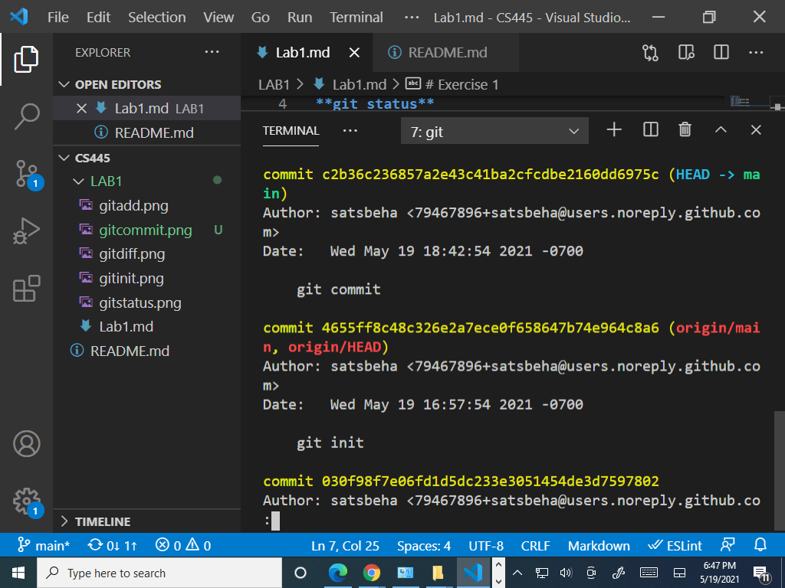
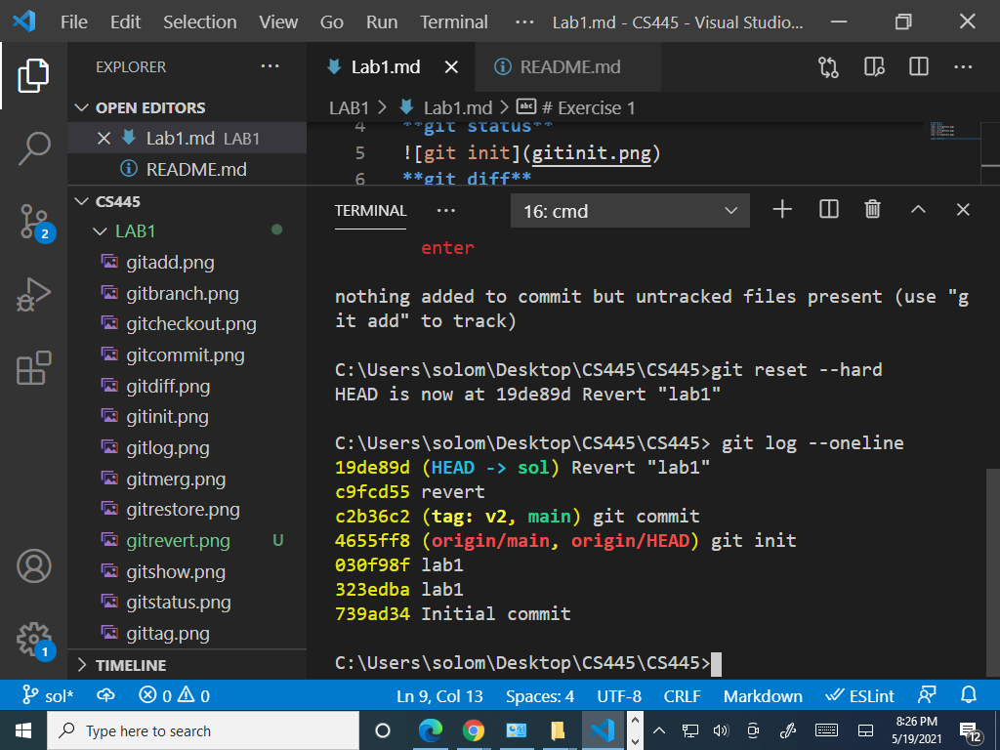

# Exercise 1
**git init**

**git status**

**git diff**

**git add**

**git commit**

**git git log**

**git show**

**git tag**

**git restore**

**git branch**

**git checkout**

**git merge**

**ggit revert**

**git reset**
